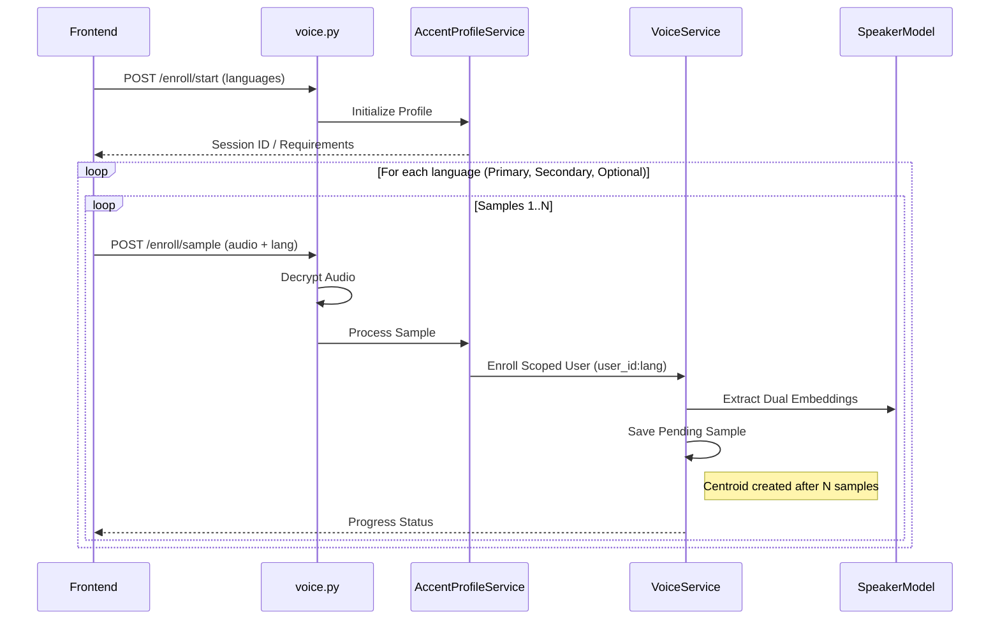

# Voice-Print Backend: Implementation Flow & Structure

This document provides a detailed overview of the currently implemented flow and folder structure for the `voice-print-backend` project.

---

## 📂 Project Folder Structure

The project follows a modular structure separated into API layers, core logic, and specialized services.

```text
voice-print-backend/
├── app/
│   ├── api/
│   │   └── v1/
│   │       └── voice.py          # FastAPI Router: Primary API endpoints
│   ├── core/
│   │   └── crypto/
│   │       └── xor_cipher.py     # XOR-based audio encryption/decryption
│   ├── models/                   # Pydantic schemas and data models
│   ├── services/                 # Business Logic Layer
│   │   ├── accent/               # NEW: Multi-language & accent logic
│   │   │   ├── accent_profile_service.py   # Orchestrator for language buckets
│   │   │   ├── enrollment_policy.py        # Rules for language enrollment
│   │   │   └── verification_policy.py      # Decision logic for accent-matching
│   │   ├── voice_service.py      # Core voice enrollment & verification
│   │   ├── speaker_model.py      # Wrapper for ECAPA-TDNN & X-Vector models
│   │   ├── speaker_model_provider.py # Factory for selecting models
│   │   ├── audio_validator.py    # Voice activity detection & quality checks
│   │   └── embedding_utils.py    # Math/Tensor helpers for centroids
│   └── main.py                   # FastAPI Application initialization
├── storage/                      # Persistence Layer
│   ├── embeddings/               # Finalized speaker profiles (.pt & profile.json)
│   └── pending/                  # Temporary storage for partially enrolled samples
├── pretrained_models/            # Local storage for model weights
└── audio/                        # Temporary directory for audio processing
```

---

## 🔄 Implementation Flow

The backend implements a sophisticated, multi-stage process for securing and processing voice data.

### 1. 🛡️ Audio Security (XOR Cipher)
To protect voice data in transit, the system implements a symmetric encryption layer:
- **Frontend**: Encrypts raw audio bytes using an `XORCipher` with a shared secret key.
- **Backend**: Every voice-related endpoint (`/enroll/sample`, `/accent/verify`, etc.) decrypts the incoming `UploadFile` bytes at the API boundary before any processing occurs.

### 2. 👥 Accent-Aware Enrollment Flow
The new flow supports "buckets" for different languages/accents to improve accuracy for multilingual users.



**Key Features:**
- **Language Buckets**: Each language is enrolled into its own "scoped" profile (e.g., `user_123:hi-IN`).
- **Centroid Calculation**: Multiple samples (default: 3) are required for each bucket. These are combined into a robust "centroid" embedding.
- **Dual Model Enrollment**: Every sample is processed by two models: **ECAPA-TDNN** (Primary) and **X-Vector** (Secondary).

### 3. ✅ Accent-Aware Verification Flow
Verification uses "strategies" to handle the multiple language buckets enrolled for a user.

- **Strategies**:
    - `best_of_all`: Tries the input voice against all enrolled language buckets and returns the best match.
    - `accent_matched`: Uses advisory accent detection to pick the most likely bucket first.
    - `declared_language_fallback`: Tries buckets in order of priority (Primary → Secondary → Optional).

- **Decision Policy (Dual Scoring)**:
    - The system calculates similarity scores for both models.
    - A comparison is made against a configurable `SIMILARITY_THRESHOLD`.
    - Scores are "fused" if both models are available to increase confidence.

### 4. 🗄️ Storage Mechanics
- **Finalized Profiles**: Stored as `.pt` (PyTorch) files containing primary and secondary centroids, metadata (timestamps), and versioning.
- **Profile Metadata**: `profile.json` tracks the high-level user preferences and enrollment progress.
- **Pending Samples**: Partial enrollments are stored in a dedicated `pending/` directory until the requirement is met, at which point they are combined and cleaned up.

### 5. 🌍 Language Identification (LID)
The system integrates **SpeechBrain LID** to detect the spoken language from raw audio.
- **Control Plane Only**: LID is used for routing to language buckets and ordering fallback strategies.
- **Strict Advisory**: It never affects the speaker embeddings or similarity scores directly.

---

## 🛠️ Technological Stack

- **Framework**: FastAPI (Asynchronous Python)
- **Deep Learning**: PyTorch + Torchaudio
- **Models**: 
    - **Speaker Identity**: ECAPA-TDNN & X-Vector (SpeechBrain)
    - **Language ID**: VoxLingua107 LID-ECAPA (SpeechBrain)
    - **VAD**: Silero VAD
- **Security**: XOR-based byte stream encryption.
- **Logic**: Accent-aware policies for custom enrollment and verification thresholds.
